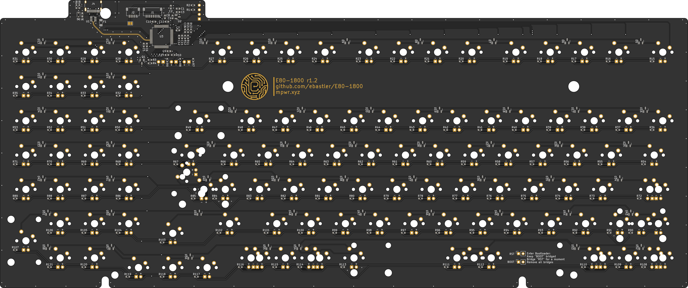
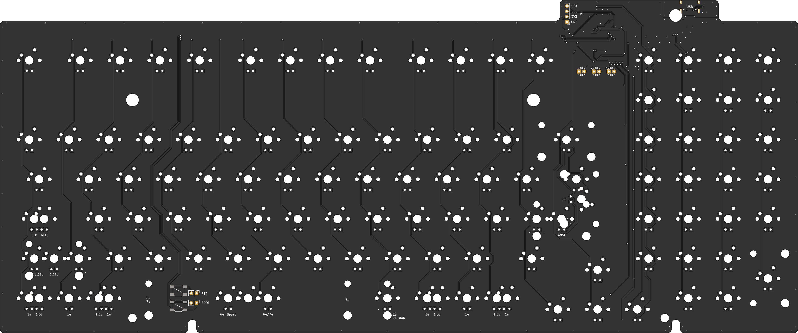

# E80-1800
QMK compatible USB-C PCB for a Cherry G80-1800

The board has been prototyped and works as intended, while fitting most G80-1800 housings. Rev 1.1 and later should fix all tolerance issues, and fit all G80-1800 (and as far as I know also G81-1800) enclosures. I can, however, not guarantee perfect operation of the PCB or compatibility with every enclosure variation - if you encounter any issues, please let me know. Rev 1.2 has not yet been tested, but changes were minimal - no issues are to be expected. Stock situations as well as component rotations at JLC may change over time and hence I can not guarantee for the BOM/CPL files to work perfectly. Please double-check before ordering!

|||
|:----------------------------------------:|:----------------------------------------:|

## Order information at JLCPCB
All relevant files can be found in `E80-1800-pcb-universal\jlcpcb`. The `gerber` subfolder contains a .zip file, the `assembly` subfolder contains the BOM and POS/CPL files needed for assembly. Please double-check all component values and rotations before ordering!

* [gerber](E80-1800-pcb-universal/jlcpcb/gerber/GERBER-E80-1800-pcb-universal.zip)
* [BOM](E80-1800-pcb-universal/jlcpcb/assembly/BOM-E80-1800-pcb-universal.csv)
* [POS](E80-1800-pcb-universal/jlcpcb/assembly/POS-E80-1800-pcb-universal.csv)

Since jlcpcb usually fails to auto-determine the PCB dimensions: `382 x 160 mm` is the correct size.

Consider donating me a few bucks if you order boards :)

## Features
 - USB-C (you have to widen the cable hole in the case with a file or similar)
 - Full ESD protection
 - Future-proof STM32F072 with QMK
 - Optional I²C OLED screen in the card-reader-hole on card-reader G80-1800 models
 - SPI header for Bluetooth LE - software support may or may not follow (currently not supported by QMK). The SPI pads can also be used for other expansions such as adding a Solenoid or RGB stripe.
 - Header to connect an optional battery management daughterboard
 - Single color dimmable backlight (3mm LEDs)
 - Silkscreen labels for LED polarity and multi-layout options for easier assembly

The board is fully supported by the QMK master branch: https://github.com/qmk/qmk_firmware/tree/master/keyboards/ebastler/e80_1800
A VIA compatible JSON file can be found in the "VIA" folder of this repo, and the PCB is also fully supported by https://remap-keys.app

## Supported layouts
The PCB was designed to support all layout options G80-1800 and G81-1800 were originally available in. I did not include layout options that go beyond those on purpose, since overlapping switch holes lead to wobbly switches (remember, the G80 boards are plateless!) which diminishes the typing experience. 
 - Full ISO and ANSI support
 - 1 - 1 - 1 - 6 - 1 - 1 - 1 - 1 bottom row (with flipped or regular spacebar)
 - 1.5 - 1.5 - 7 - 1.5 - 1.5 bottom row
 - Stepped and regular caps lock

## Thanks to
 - [Evy](https://github.com/evyd13) for supplying me with her [GH80-1800 drop in replacement PCB](https://geekhack.org/index.php?topic=96692.0) layout, which I could use for dimensions and measurements - saved me a lot of time! Even if I ended up redrawing the dimensions from scratch and changing a few, being able to use his as a starting point was a lot of help.
 - SMOKEY for motivating me once I lost the will to continue with the project
 - MarvFPV for helping me with the physical PCB dimensions and supplying me with valuable ideas
 - Zitres for organizing and shipping a small-batch closed GB together with me that led to a lot of satisfied users
