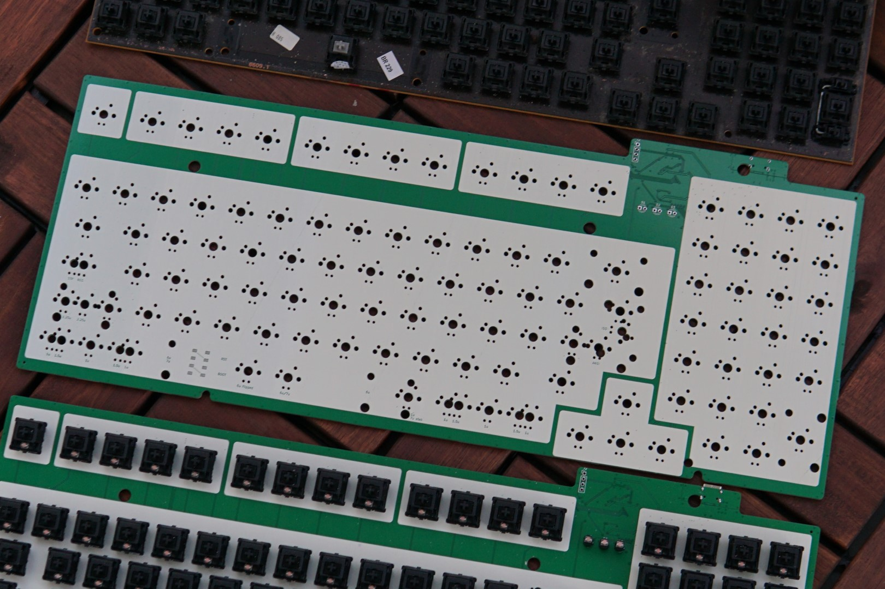
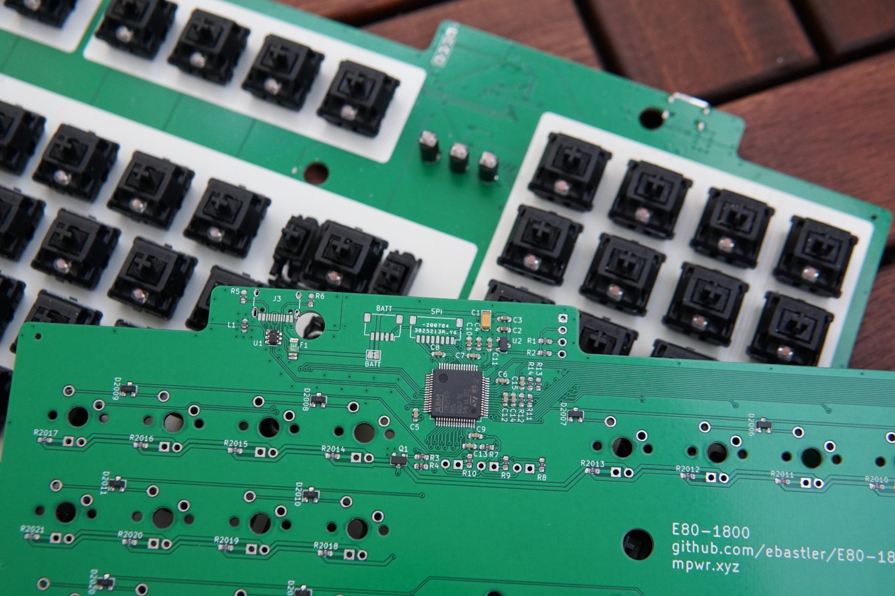

# E80-1800
 QMK compatible USB-C PCB for a Cherry G80-1800

 The first 9 prototypes have been built and work as intended, while fitting most G80-1800 housings. A new revision has been uploaded which should fix all tolerance issues, and fit all G80-1800 (and as far as I know also G81-1800) enclosures. I can, however, not guarantee perfect operation of the PCB or compatibility with every enclosure variation - if you encounter any issues, please let me know. The new revision is not yet tested, but changes were small - no issues are to be expected. Correct rotation of the MCU in the CPL file could NOT be tested due to it being out of stock at JLC. Please double-check before ordering!

|||
|:----------------------------------------:|:----------------------------------------:|

## Features
 - USB-C (you have to widen the cable hole in the case with a file or similar)
 - Full ESD protection
 - Future-proof STM32F072 with QMK
 - Optional I²C OLED screen in the card-reader-hole on card-reader G80-1800 models
 - SPI header for Bluetooth LE - software support may or may not follow (currently not supported by QMK)
 - Header to connect an optional battery management daughterboard
 - Single color dimmable backlight (3 mm LEDs)
 - White silk background below caps, in order to hide the green soldermask on plateless builds (jlcpcb only assembles green PCBs)

 The temporary firmware repo can be found here, pull request to QMK will be done once the project is complete: https://github.com/ebastler/qmk_firmware/tree/E80_1800/keyboards/ebastler/E80_1800

## Supported layouts
 - Full ISO and ANSI support
 - 1 - 1 - 1 - 6 - 1 - 1 - 1 bottom row (with flipped or regular spacebar)
 - 1.5 - 1.5 - 7 - 1.5 - 1.5 bottom row
 - Stepped and regular caps lock

## Thanks to
 - [Evy](https://github.com/evyd13) for supplying me with her [GH80-1800 drop in replacement PCB](https://geekhack.org/index.php?topic=96692.0) layout, which I could use for dimensions and measurements - saved me a lot of time! Even if I ended up redrawing the dimensions from scratch and changing a few, being able to use his as a starting point was a lot of help.
 - SMOKEY for motivating me once I lost the will to continue with the project
 - MarvFPV for helping me with the physical PCB dimensions and supplying me with valuable ideas
